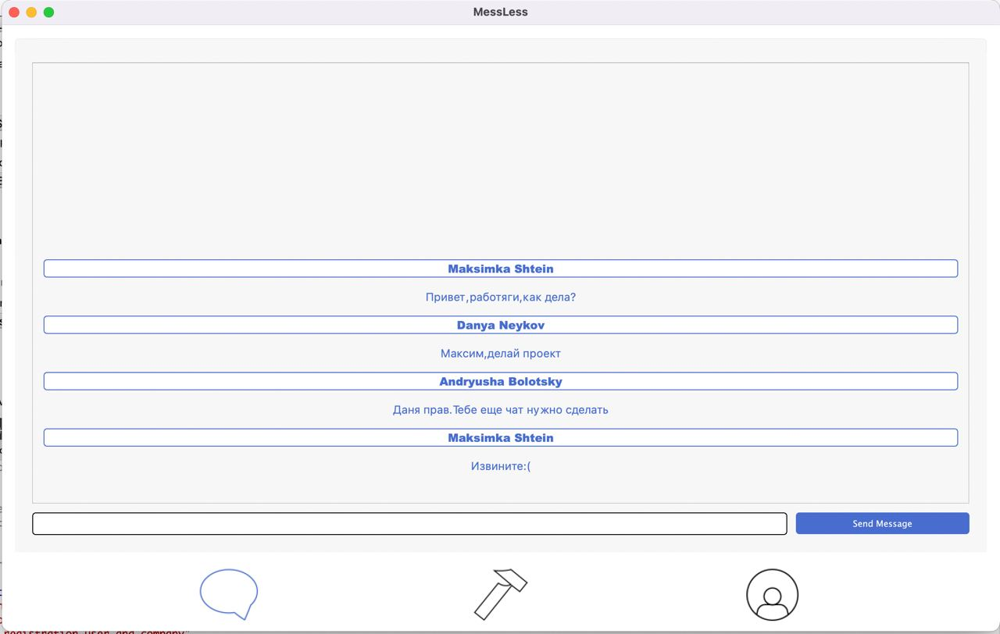
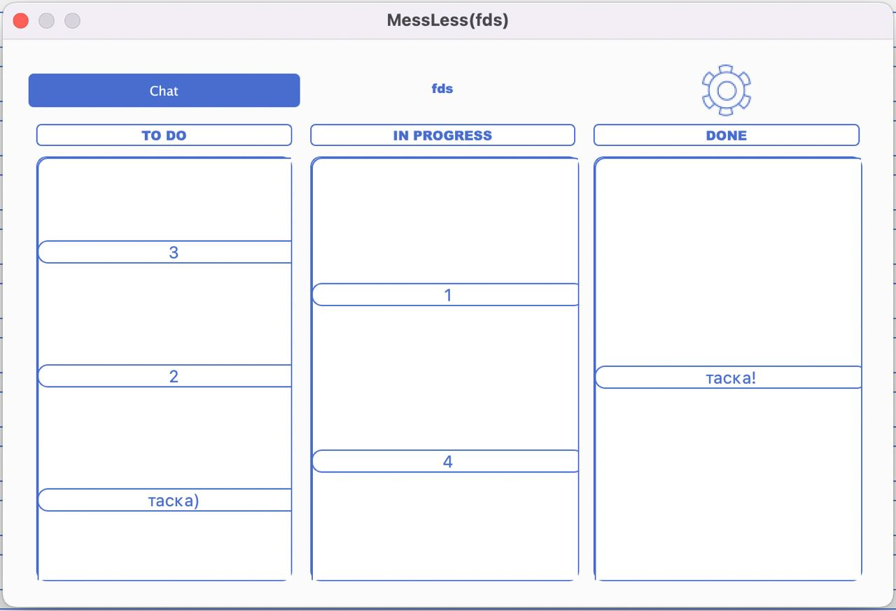
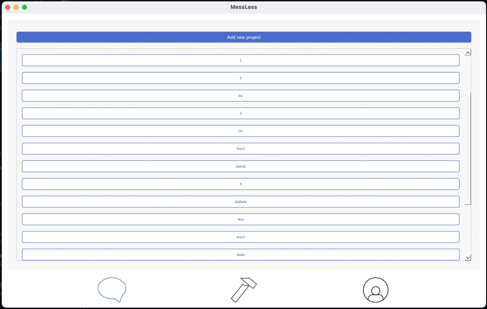
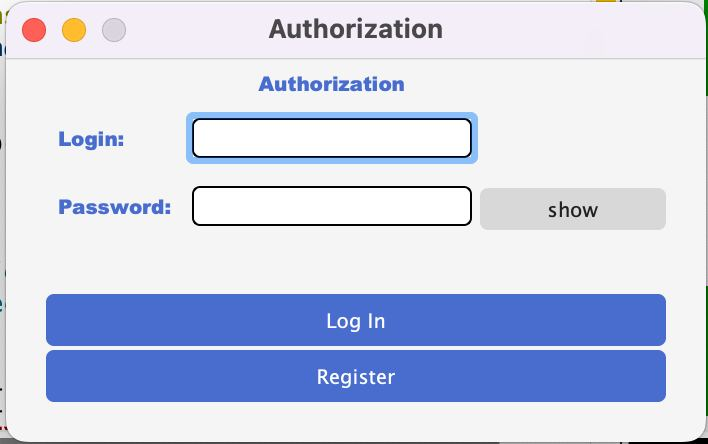

# MessLess

## Проект на C++

### Описание
-----
**Десктопное приложение рассчитанное на оптимизацию рабочего процесса и налаживания взаимодействия между сотрудниками, отслеживание задач и ошибок. Включает в себя взаимодействие по сети следующего вида: общее рабочее пространство (папки по активным\закрытым проекта, в которых содержится соответствующая информация о них, активные задачи с возможностью сортировки их по дате выдачи, приоритету и сроку выполнения); общие рабочие чаты для каждого активного проекта, а также личное рабочее пространство(персональные данные, текущие задачи сотрудника, информация о том, в каких проектах сотрудник состоит. Для хранения информации о пользователях используются базы данных.**

Наша команда:
- Болоцкий Андрей
- Нейков Даниил
- Штейн Максим

### Cкриншоты 

