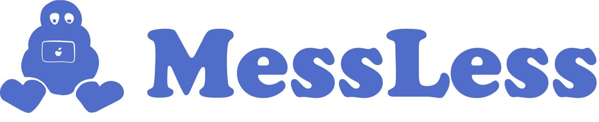

# MessLess

### Описание
-----
Десктопное приложение рассчитанное на оптимизацию рабочего процесса и налаживания взаимодействия между сотрудниками, отслеживание задач и ошибок. Включает в себя взаимодействие по сети следующего вида: общее рабочее пространство; общие рабочие чаты для каждого активного проекта. Для хранения информации о пользователях используются базы данных.

Наша команда:
- Болоцкий Андрей
- Нейков Даниил
- Штейн Максим

### Зависимости
* В проекте используется для внешнего вида и сетевого взаимодействия QT 5.12
* На серверной части приложения используется QT для работы с сетью
* Система управления базами данных - PostgreSQL 12
* Для взаимодействия базы данных и серверной приложения используется libpqxx 7.4
* Для шифрования используется cryptopp 8.7.0

